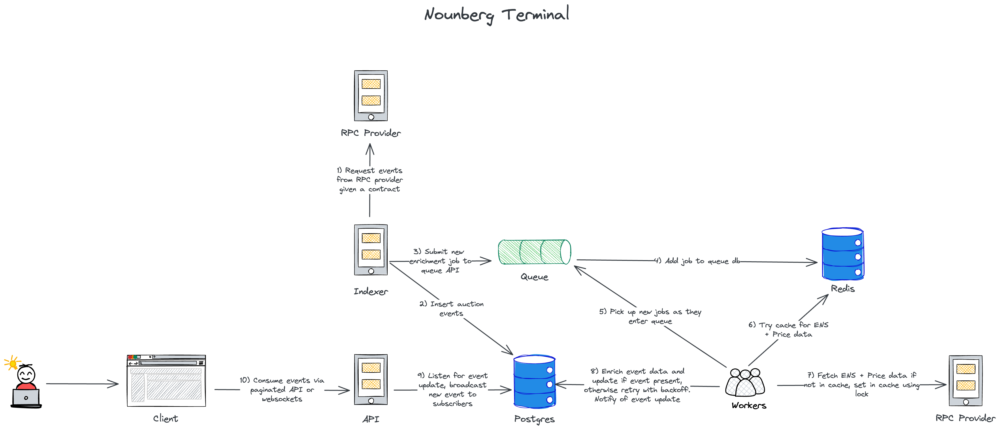

# Nounberg Terminal

A real‑time **Nouns DAO** auction tracker that **indexes** on‑chain events, **enriches** them with off‑chain context, produces concise human‑readable headlines, and serves both a paginated REST feed **and** a live WebSocket stream.

---

## 🏗️ Architecture Overview



*Diagram shows event flow and external integrations; each service is detailed below.*

### Services

| Package                             | Tech Stack                   | Responsibility                                                                                                                                                                                                                                      | Notable Features                                                                                                                                                                                               |
| ----------------------------------- | ---------------------------- | --------------------------------------------------------------------------------------------------------------------------------------------------------------------------------------------------------------------------------------------------- | -------------------------------------------------------------------------------------------------------------------------------------------------------------------------------------------------------------- |
| **Indexer**<br>`packages/indexer`   | Ponder (TypeScript)          | Streams `AuctionCreated`, `AuctionBid`, `AuctionSettled` from main‑net and writes a **base event** row keyed by the on‑chain `event.id`.                                                                                                            | • Re‑org rollback via Ponder hooks<br>• Built‑in GraphQL explorer at `:42069`<br>• `ON CONFLICT` safeguard in case of duplicate or rolled‑back logs<br>• Enqueues enrichment jobs after insert                 |
| **Queue**<br>`packages/queue`       | BullMQ + Redis               | Receives enrichment jobs; exposes Prometheus metrics & `/health`.                                                                                                                                                                                   | • Lock‑manager sets prevent duplicate ENS / price cache fetches (called "thundering herd")<br>• Completed jobs are **immediately removed** to keep Redis lean during spikes (configurable retention window if forensic traces are needed) |
| **Workers**<br>`packages/queue`     | BullMQ worker‑pool (Node TS) | Fetches jobs, enriches with USD price, ENS, thumbnail, and headline, then **GETs + UPDATEs** the event row (no upsert). Inserts are left solely to the Indexer so Ponder can manage rollbacks; if the row isn’t present yet the job simply retries with exponential backoff. | • Redis cache (48 h ENS, 1 h price) behind lock‑manager keys so only one worker populates a miss<br>• Alchemy historical price API<br>• Thumbnails via `https://noun.pics/{nounId}`                            |
| **API**<br>`packages/api`           | Hono.js                      | Cursor‑based REST `/api/events` and WebSocket `/ws`; relays Postgres `LISTEN/NOTIFY`.                                                                                                                                                               | • Single service handles HTTP **and** WS for PoC; for prod a dedicated realtime gateway is preferred<br>• **No OpenAPI docs** — endpoint schema described in README                                            |
| **Frontend**<br>`packages/frontend` | React + TailwindCSS          | Lets users (1) watch the live stream, (2) **scroll forward** through history via cursor pagination, (3) filter by event type or noun ID.                                                                                                            | –                                                                                                                                                                                                              |
| **Datastores**                      | PostgreSQL / Redis           | Truth store and cache/queue backend.                                                                                                                                                                                                                | • Triggers emit `NOTIFY auction_updated` consumed by the API                                                                                                                                                    |

---

## 📂 Data Model

All events reside in a single **`auction_events`** table keyed by the **on‑chain** `event_id` (transaction hash + log index, exposed by Ponder as `event.id`).

| column            | type               | purpose                          |
| ----------------- | ------------------ | -------------------------------- |
| `event_id`        | `text PRIMARY KEY` | unique id frome event            |
| `event_type`      | `text`             | `created`, `bid`, `settled`      |
| `block_timestamp` | `numeric(78)`      | used for cursor pagination       |
| `headline`        | `text`             | human‑readable summary           |
| …                 | …                  | other enrichment fields          |


### Why denormalise?

* The feed is consumed chronologically; explicit columns (many nullable) avoid costly joins or unions.
* Cursor pagination using **`block_timestamp DESC, event_id DESC`** is fairly stable for this single‑collection feed. To be honest, this works well only because it's a single contract table, but if you had to support additional contracts, timestamps from parallel streams will interleave. You'd then either:
   • keep per‑contract tables and paginate within each, or
   • introduce a composite key (collection_id, block_timestamp, event_id) and paginate per collection_id. This avoids “hot shard” skew, and keeps cursor order deterministic.
* Updates are simple `UPDATE … WHERE event_id = ?` — no race with inserts.

Lots of avenues to discuss with denormalizing the data if more analytical or relational queries are required -- you can build out a normalised shadow schema, or materialised view without touching the hot path.

**Indexes in use** (defined via Ponder):

* `block_timestamp` (single‑column) — drives cursor pagination.
* `type`, `nounId` (single‑column) — quick filters in the REST endpoint.
* Compound: `(type, block_timestamp)`, `(nounId, block_timestamp)`, `(type, nounId, block_timestamp)` — cover common “show bids for noun #721”‑style queries.

Full schema lives in `packages/indexer/ponder/schema.ts`; trimmed here for readability.

---

## 🗄️ Caching Strategy & Lock Management

| Item          | TTL                                                                                   | Lock Key Example        |
| ------------- | ------------------------------------------------------------------------------------- | ----------------------- |
| ENS name      | 48 h                                                                                  | `lock:ens:0xd8dA6B…`    |
| ETH/USD price | ≤ 1 h old → **24 h TTL**<br>1 h – 24 h old → **7 d TTL**<br>＞ 24 h old → **30 d TTL** | `lock:price:<hour‑iso>` |

Workers acquire a **Redis `SETNX` lock** before external look‑ups; the first worker populates the cache, others read the cached value — eliminating duplicate calls ("thundering herd".

> **Future optimisation:** `SETNX` is simple but single‑instance. For multi‑node resilience we could switch to a [Redlock](https://redis.io/docs/latest/develop/use/patterns/distributed-locks/)‑style algorithm or use a small Lua script that performs “get or fetch then set” atomically.

---

## 🔄 End‑to‑End Flow

1. **Detect** — Indexer writes base row keyed by `event_id`.
2. **Enqueue** — Job submitted to Queue API.
3. **Lock / Set & Fetch** — Workers use a single instance lock manager where only one worker can set the price for a rounded timestamp (round to nearest hour for demo) at a time. Workers that can't acquire the lock poll the cache key directly (rather than waiting for the lock to release), ensuring they get the data when lock-holding worker populates it.
4. **Update** — Worker `UPDATE`s row with enrichment (no UPSERT needed because row already exists).
5. **Notify** — `NOTIFY auction_updated` with `event_id`.
6. **Broadcast** — API pushes JSON to WebSocket clients; REST reflects immediately.

---

## 🚀 Quick Start

```bash
# Prepare env
cp .env.example .env       # add PONDER_RPC_URL_1 and ALCHEMY_API_KEY

make start                 # build & launch full stack
```

| URL                      | Purpose                        |
| ------------------------ | ------------------------------ |
| `http://localhost:8080`  | Frontend demo (live & history) |
| `http://localhost:3000`  | REST API                       |
| `ws://localhost:3000/ws` | WebSocket feed                 |
| `ws://localhost:3001`    | Queue API                      |
| `http://localhost:42069` | Ponder GraphQL explorer        |

---

## 📡 API Reference

### GET `/api/events`

```http
GET /api/events?cursor=1708356695&limit=20&type=bid&nounId=721
```

**Query params**

| param    | description                              |
| -------- | ---------------------------------------- |
| `cursor` | opaque string `block_timestamp` |
| `limit`  | up to 100                                |
| `type`   | optional `created\|bid\|settled`         |
| `nounId` | optional filter                          |

Returns newest‑first events; exact JSON schema is documented inline in code.

### WebSocket `/ws`

```jsonc
// Client → Server
{ "type": "subscribe" }

// Server → Client
{ "type": "event", "data": { /* event object */ } }
```

### Health Endpoints

```text
GET localhost:3000/api/health        # API liveness
GET localhost:3001/health            # Queue & worker pool
```

---

## 🧪 Testing with Foundry

Top‑level **`make test`** orchestrates:

1. **start‑anvil** — mainnet fork.
2. **deploy** — deploys test contracts + simulates auction.
3. **test‑ponder** — asserts indexer/worker output.

https://media1.giphy.com/media/v1.Y2lkPTc5MGI3NjExOTI2cWZkeHp3NnBvZnY5aGswYjhjeWhrZmplMWN2MXowM24xbjI3YyZlcD12MV9pbnRlcm5hbF9naWZfYnlfaWQmY3Q9Zw/nlHN6K6xkmFmaUsmyE/giphy.gif

Makefile snippets are included below for reference.

---

## 🧠 Architectural Notes & Take‑aways

### Blockchain Tooling

* **Foundry (Forge + Anvil)** stack was really easy to set up via Docker, and provides repeatable mainnet‑fork tests for deploying the mock contract, and broadcasting events using Forge. Cardano does have a testnet with a faucet, but I'm not aware of a tool like Foundry + Anvil + Forge for Cardano. The documentation is clear and I'm looking forward to using it more.
* **Open ABIs (Etherscan):** one thing I really appreciate about Etherscan is that the underly contracts code is shared in the scanner. Having a central place to observe the contracts, receipt logs, event signatures and calldata layouts etc for Noun House was super easy. Cardano doesn't have a screener / scanner app that shows all of this information. Most of the contract interfaces we work with are in team repositories, and in some cases contract interfaces are opaque (for certain closed-source AMM / order-book exchange contracts).

### Service Boundaries

* **Dedicated API vs Indexer** — REST/WebSocket traffic runs in its own process while chain ingestion remains isolated; this separation simplifies scaling decisions (CPU for workers, I/O for API) and keeps failure domains narrow.
* **Worker Isolation & Scaling ** — Enrichment is CPU‑bound and parallel‑friendly. [BullMQ concurrency](https://docs.bullmq.io/guide/workers/concurrency) scaling makes each worker handle more jobs concurrently when the queue is busy. Alternatively you could use Docker Swarm (or another orchestration tool) to do worker scaling, have a hook to watch queue depth metrics via Prometheus, and scale according.

### Internal Communication

* **HTTP vs gRPC** — In production I’ve used gRPC for internal hops because the Protobuf contract gives compile‑time type‑safety, you get lean binary payloads, and built‑in streaming on a single HTTP/2 connection. The schema code‑gen (generating protobuf files) step is a extra chore, and you need to respect backwards-compatibility through appending of new fields. For this coding‑challenge prototype I kept the indexer→queue call as simple HTTP/JSON.

### Real‑Time Delivery

* **PostgreSQL LISTEN/NOTIFY** ensures notifications fire only after the row is committed — no dual‑write race that sometimes occurs with Redis Pub/Sub.
* **WebSocket in Hono vs dedicated gateway** — Hono’s WS support works but needs explicit upgrade handling. For production, a separate realtime service (Express with native `ws`, Fastify, uWebSockets.js) would simplify long‑lived connection management, and keep the REST layer stateless.
* **Stateful connections** — The API keeps every WebSocket client in RAM, with a single replica that’s okay, but scaling vertically would require one of a few things:
• Connection affinity (sticky sessions). Let the L7 proxy hash on a stable token (cookie, auth header, or URL param) so each socket always lands on the same pod. If the pod dies every socket drops, and you can’t scale below the number of affinity buckets.
• Shared broker / pub+sub (Redis / NATS / Kafka). Every pod publishes the event, and independently fan-outs to its own clients. Replicas publish a headline, and every gateway instance fan‑outs to its local clients.  You can get zero‑downtime rolling deploys, and scaling at the cost of one more infra component.
* **Subscription filtering & rate‑limits** — As an enhancement, you could support consumers sending a subscription message with filters (e.g nounId, eventType, etc.). The API would store those predicates per socket, and forward only matching events. EIP‑4361 auth tokens gate users from the websocket, what a client can subscribe to, and a small token‑bucket guards against subscribe‑spamming.

### Upsert vs Update

* **Current flow:** Indexer performs the insert via Ponder’s Store API, which buffers writes in‑memory during historical sync and flushes them to PostgreSQL with COPY. Workers GET + UPDATE the event from the job data. This keeps insert logic in one place — the component that knows how to handle the re-orgs — and avoids cross‑service contention.

* **Scaling:** In production, more worker replicas (Docker Compose ▶ `--scale workers=N`, ECS service, etc.) consume the same queue. Because every job ultimately resolves to a single GET + UPDATE, contention is fairly minimal, and database locks remain short‑lived. BullMQ’s [batch jobs](https://docs.bullmq.io/bullmq-pro/batches) / pipelines could help by letting each worker acknowledge multiple completed jobs in one round‑trip.

* **Gripe with Ponder Drizzle API** Store API is part of Ponder’s runtime and only available inside its hooks; the drizzle it exposes is read‑only and lacks listen/notify. The API and workers run as a standalone Node service with their own connection pool; the API uses drizzle + PG for listen/notify, and the workers use raw SQL.

### Observability

* **Prometheus metrics** already exposed by Indexer and Queue/Worker.
* **Structured logging** — Used a replica of Ponder’s internal logger using pino just for consistency / convenience, logging pretty for the purpose of the demo, but would use JSON for making aggregation in Loki or Elasticsearch (or any other solution) straightforward.

---

## 🛠️ Makefile Commands

Below are the **user‑facing commands** you’ll run most often; full recipes are in each Makefile.

| Command             | Mode     | Description                                                                                |
| ------------------- | -------- | ------------------------------------------------------------------------------------------ |
| `make start`        | **Prod** | Build and launch the complete stack (all services + infra)                                 |
| `make dev`          | **Dev**  | Spin up Postgres & Redis only; you then run one or more `make dev‑<service>` targets below |
| `make dev-indexer`  | **Dev**  | Start the indexer with live‑reload, relying on the shared infra from `make dev`            |
| `make dev-api`      | **Dev**  | Start the REST + WebSocket API                                                             |
| `make dev-workers`  | **Dev**  | Launch the worker pool & queue API                                                         |
| `make dev-frontend` | **Dev**  | Start the React front‑end (Vite dev server)                                                |
| `make test`         | **Test** | End‑to‑end Foundry run (fork mainnet, deploy contracts, assert indexing)                   |
| `make stop`         | —        | Bring down all running containers                                                          |
| `make clean`        | —        | Stop containers and prune Docker artefacts                                                 |

For contract‑level tests the **Foundry Makefile** offers:

| Command            | Purpose                                                            |
| ------------------ | ------------------------------------------------------------------ |
| `make start-anvil` | Spin up an **Anvil** mainnet fork (side stack)                     |
| `make deploy`      | Build a small deployer image and simulate a complete auction cycle |
| `make test-ponder` | Run Ponder against that fork and verify events                     |
| `make test`        | Shortcut: `start-anvil ▶ deploy ▶ test-ponder`                     |
